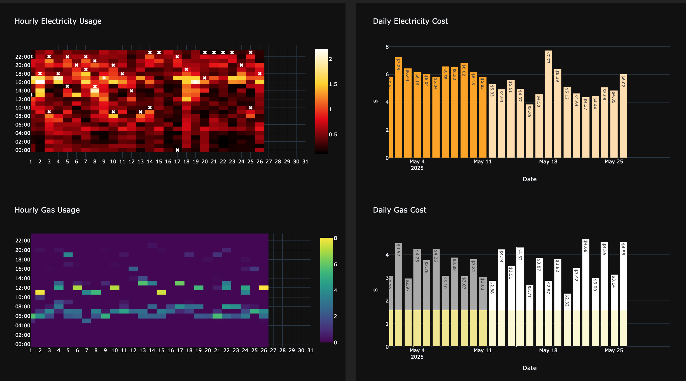

# DASH Framework for energy usage

## Purpose

This is a very basic attempt at using Dash to represent household power and gas usage based on hourly usage data. This project was triggered by receiving a powerbill 40-50% higher than expected. 

The purpose of the dashboards was originally to get a better understanding of the pattern of power usage, and the appliances that were responsible for the increased draw. Once the reasons were understood, the ongoing use of the dashboard is to monitor the patterns of usage and ensure things stay under control.

## Data sources 
The energy usage data has been downloaded as daily csv files with hourly usage totals from the [Genesis Energy website](https://www.genesisenergy.co.nz) and subsequently stored in a parquet file. There needs to be something scheduled to review the download folder and update the parquet file. At the moment, updates occur by running `main.py`.

Note: There is be a webservice that might be used for this, but accessing and understanding it is still a work in progress. 

Air Temperature data has also been pulled from [Taranaki Regional Council's](https://www.trc.govt.nz/) [environmental data service](https://extranet.trc.govt.nz/getdata/boo.hts). This data is pulled as 10 minute time-value pairs and stored in a parquet file before plotting on the dashboard.

## Dash framework
A combination of ChatGPT and Gemini prompts have been used in the construction of the dashboards. It made getting a working framework up and running much quicker.

## Future work

I want to get this dashboard running on a webserver, with automated tasks to check for new data. 